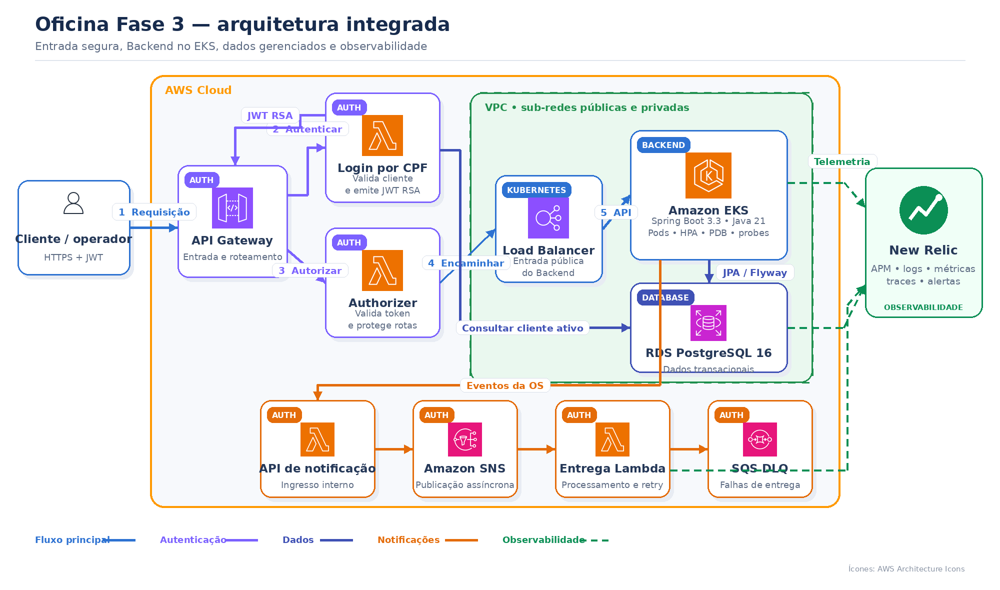

# Oficina Fase 3 — documentação central

Este repositório é o ponto de entrada funcional, técnico e acadêmico da Oficina Fase 3. Ele permite compreender o negócio, a arquitetura, as decisões, o CI/CD, o bootstrap e as evidências, sem substituir ou alterar os quatro projetos originais.

## Visão de negócio

A Oficina organiza o ciclo completo de atendimento de uma oficina mecânica: cadastro do cliente e do veículo, recepção, diagnóstico, orçamento, aprovação, execução do reparo, consumo de peças, pagamento e entrega. Também apoia estoque, compras de fornecedores, movimentações financeiras, notificações e relatórios operacionais.

O sistema atende clientes, funcionários, técnicos e gestores. A **Ordem de Serviço (OS)** é o agregado central e mantém o histórico da jornada:

```text
Recebida → Em diagnóstico → Aguardando aprovação → Em execução
→ Aguardando pagamento → Paga → Entregue
```

Rejeições e cancelamentos seguem regras próprias. O histórico permite acompanhar o atendimento e calcular indicadores como volume de OS e tempos médios por etapa.

## Evolução para a Fase 3

A Fase 2 consolidou as regras de negócio em um Backend Java com Clean Architecture, banco relacional, testes, Docker, Kubernetes, Terraform e CI/CD. A Fase 3 preserva essas funcionalidades e responde ao cenário de crescimento da base de clientes e expansão para múltiplas unidades, acrescentando segurança, escalabilidade, alta disponibilidade e observabilidade corporativa.

A entrada utiliza o **Amazon API Gateway**. Uma **Function Serverless** valida o CPF, consulta a existência e o status do cliente no PostgreSQL e emite um **JWT RSA de curta duração**. O Lambda Authorizer protege as APIs do cliente antes de encaminhar a chamada ao Backend no EKS.

A evolução também separa aplicação, autenticação, banco e Kubernetes em quatro projetos com pipelines independentes, ambientes de homologação e produção e telemetria centralizada no New Relic.

- [Visão detalhada de negócio, evolução e engenharia](docs/visao-negocio-e-engenharia.md)

## Aplicações da solução

| Componente | Contribuição para o negócio | Responsabilidade técnica | Documentação |
|---|---|---|---|
| Backend | Executa o atendimento e as regras da oficina. | APIs, domínio, migrations, Docker e deploy no EKS. | Este repositório · [Projeto original](https://github.com/tiagomiele/fiap-tech-challenge-fase3-oficina-backend) |
| Auth | Permite acesso seguro do cliente e notificações desacopladas. | CPF, JWT, API Gateway, Authorizer, SNS e DLQ. | [Auth](https://github.com/tiagomiele/auth) · [Projeto original](https://github.com/tiagomiele/fiap-tech-challenge-fase3-oficina-auth-serverless) |
| Database | Preserva os dados operacionais com consistência e recuperação. | RDS privado, backup, segurança, logs e telemetria. | [Database](https://github.com/tiagomiele/database) · [Projeto original](https://github.com/tiagomiele/fiap-tech-challenge-fase3-oficina-database-infra) |
| Kubernetes | Mantém a aplicação disponível, escalável e observável. | VPC, EKS, nodes, add-ons, HPA e New Relic. | [Kubernetes](https://github.com/tiagomiele/kubernetes) · [Projeto original](https://github.com/tiagomiele/fiap-tech-challenge-fase3-oficina-kubernetes-infra) |

## Modelo arquitetural e práticas

A solução distribui responsabilidades entre quatro repositórios, mas mantém o domínio principal em um **monólito modular**. O Backend aplica **DDD e Clean Architecture em quatro anéis** (`Domain`, `Usecase`, `Adapter` e `Infrastructure`), com dependências apontando para o domínio e limites verificados por ArchUnit.

O Auth utiliza camadas leves de domínio, aplicação, handlers e infraestrutura, adequadas às Lambdas. Database e Kubernetes adotam **Infrastructure as Code declarativa**, com Terraform, states separados e plans revisáveis. Clean Code, SOLID, testes automatizados, formatação, análise de segurança, revisão por Pull Request e observabilidade são práticas transversais.

> Clean Code e SOLID são princípios de desenvolvimento; o modelo estrutural comprovado do Backend é Clean Architecture. Os projetos de infraestrutura não simulam camadas de aplicação: seguem organização própria de IaC.

## Arquitetura específica do Backend



O Backend concentra o domínio da oficina. API Gateway, autenticação, banco e plataforma Kubernetes permanecem desacoplados em projetos independentes.

- [Diagrama completo de componentes](docs/architecture/componentes.md)
- [Sequência de autenticação por CPF](docs/architecture/autenticacao.md)
- [Sequência de abertura da ordem de serviço](docs/architecture/abertura-ordem-servico.md)

## Tecnologias

| Área | Tecnologias e finalidade |
|---|---|
| Arquitetura | DDD, Clean Architecture, monólito modular, serverless e Infrastructure as Code |
| Aplicação | Java 21, Spring Boot 3.3, Spring Security, JPA/Hibernate e Flyway |
| APIs e segurança | API Gateway v2, AWS Lambda, Lambda Authorizer e JWT RSA |
| Dados | Amazon RDS PostgreSQL 16, constraints, índices, migrations, backup e SSL |
| Plataforma | Amazon EKS, Kubernetes, Helm, HPA, PDB, Metrics Server e Load Balancer |
| Entrega | GitHub Actions, Docker, GHCR, Terraform, HCP Terraform e GitHub Environments |
| Qualidade | JUnit 5, Mockito, RestAssured, Testcontainers, ArchUnit, JaCoCo, Newman e k6 |
| Segurança de código e IaC | SBOM CycloneDX, Trivy, Checkov, TFLint, actionlint, ShellCheck e Gitleaks |
| Observabilidade | New Relic APM, logs JSON, correlação, traces, dashboards, alertas e sintéticos |

## Execução e deploy

A implantação completa deve respeitar a dependência entre os projetos:

```text
Kubernetes → Database → Auth → Backend
→ reaplicar Auth → reaplicar observabilidade → executar E2E
```

- [Ciclos CI/CD de homologação e produção](docs/cicd-promocao.md)
- [Bootstrap: subir a Oficina Fase 3 na AWS do zero](docs/bootstrap-aws-do-zero.md)
- [Instruções locais do Backend](https://github.com/tiagomiele/fiap-tech-challenge-fase3-oficina-backend#executar-localmente)

Toda alteração nos projetos originais deve passar por Pull Request. O CI valida a mudança; o Terraform Plan antecipa o impacto; o merge dispara o deploy do ambiente correspondente. Produção utiliza configuração e aprovação próprias.

## Swagger, OpenAPI e Postman

- [Swagger e execução local do Backend](https://github.com/tiagomiele/fiap-tech-challenge-fase3-oficina-backend#executar-localmente)
- [Collection Postman da validação integrada](https://github.com/tiagomiele/fiap-tech-challenge-fase3-oficina-backend/blob/main/tests/postman/oficina-weeks4-5.postman_collection.json)
- [Contrato OpenAPI da autenticação](https://github.com/tiagomiele/fiap-tech-challenge-fase3-oficina-auth-serverless/blob/main/docs/openapi/oficina-auth.yaml)

As URLs implantadas no AWS Academy são temporárias. Os links de Swagger e API Gateway ativos devem ser atualizados após cada reconstrução do ambiente.

## Evidências

- [Índice de APIs, testes, deploys e E2E](docs/evidencias.md)
- [Requisitos de observabilidade e locais para anexar evidências](docs/observabilidade-evidencias.md)
- [Matriz de requisitos acadêmicos](docs/matriz-requisitos.md)

## Decisões arquiteturais

### RFCs

- [AWS e estratégia de ambientes](docs/decisions/rfc/0001-aws-e-ambientes.md)
- [PostgreSQL gerenciado no RDS](docs/decisions/rfc/0002-postgresql-rds.md)
- [Autenticação por CPF e JWT](docs/decisions/rfc/0003-autenticacao-cpf-jwt.md)
- [Observabilidade com New Relic](docs/decisions/rfc/0004-observabilidade-new-relic.md)

### ADRs

- [Repositórios independentes](docs/decisions/adr/0001-repositorios-independentes.md)
- [Comunicação assíncrona](docs/decisions/adr/0002-comunicacao-assincrona.md)
- [Alta disponibilidade e HPA](docs/decisions/adr/0003-alta-disponibilidade-hpa.md)
- [Logs estruturados e correlação](docs/decisions/adr/0004-logs-correlacao-traces.md)

## Entrega acadêmica final

O PDF enviado ao portal deve centralizar:

1. links dos quatro projetos originais;
2. links das documentações;
3. vídeo de até 15 minutos no YouTube ou Vimeo;
4. evidências de CI/CD, APIs, E2E e New Relic;
5. confirmação de que `soat-architecture` foi adicionado aos quatro projetos.
