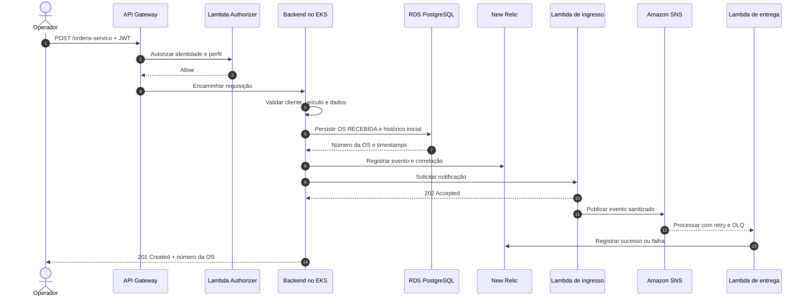

# Fluxo de abertura de ordem de serviço

## Resultado

A OS é persistida de forma transacional. A notificação é desacoplada do fluxo principal: indisponibilidade da entrega não desfaz a criação da ordem de serviço.
