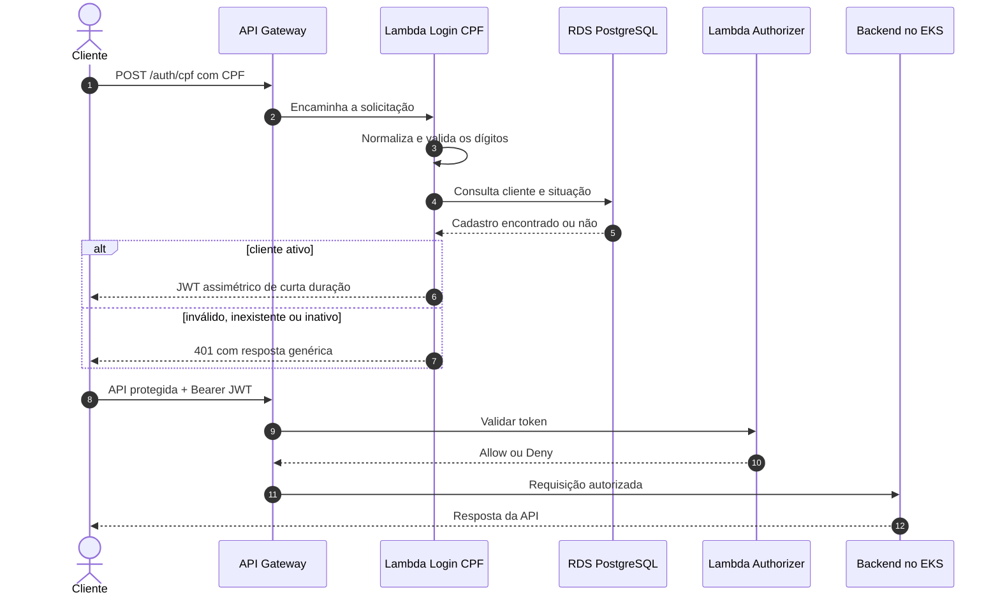

# Fluxo de autenticação por CPF

## Controles de segurança

- CPF mascarado nos logs.
- Resposta genérica para evitar enumeração de clientes.
- JWT RSA de curta duração.
- Validação de assinatura, emissor, audiência e expiração.
- Rotas administrativas continuam restritas aos perfis internos.
