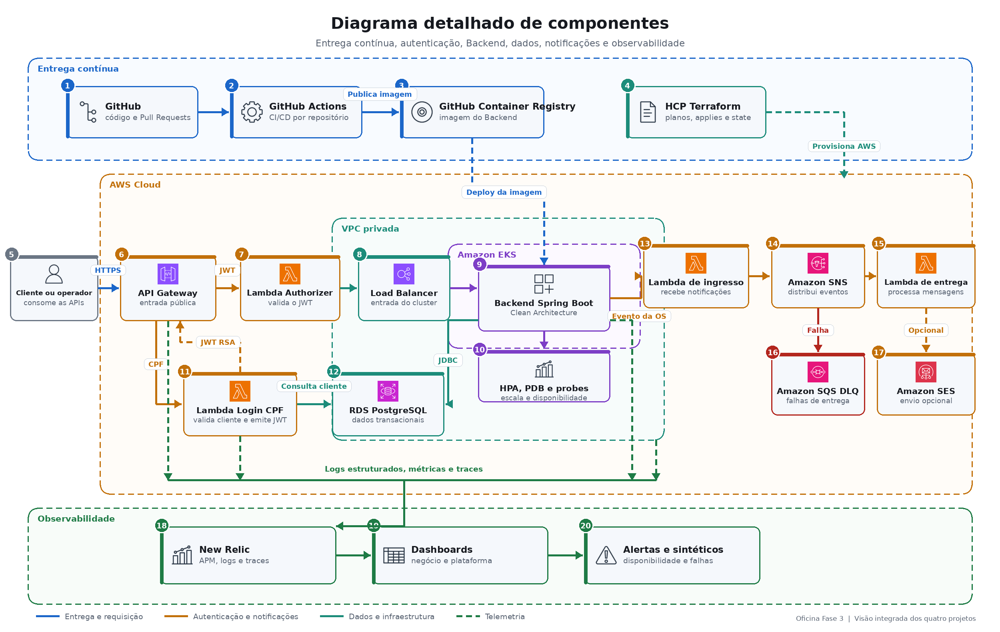

# Diagrama de componentes

## Objetivo

Apresentar, em uma única visão, nuvem, APIs, aplicação, banco, autenticação, notificações e monitoramento.

## Responsabilidades

- **API Gateway:** entrada única e roteamento das APIs.
- **Login CPF:** valida CPF, consulta o cliente e emite JWT assimétrico.
- **Authorizer:** valida assinatura, emissor, audiência e validade do JWT.
- **Backend no EKS:** executa o domínio da oficina e escala horizontalmente.
- **RDS PostgreSQL:** mantém dados transacionais em rede privada.
- **SNS, Lambda e DLQ:** processam notificações de forma assíncrona.
- **New Relic:** centraliza métricas, logs, traces, dashboards e alertas.
- **GitHub Actions e HCP Terraform:** validam, provisionam e promovem os ambientes.
