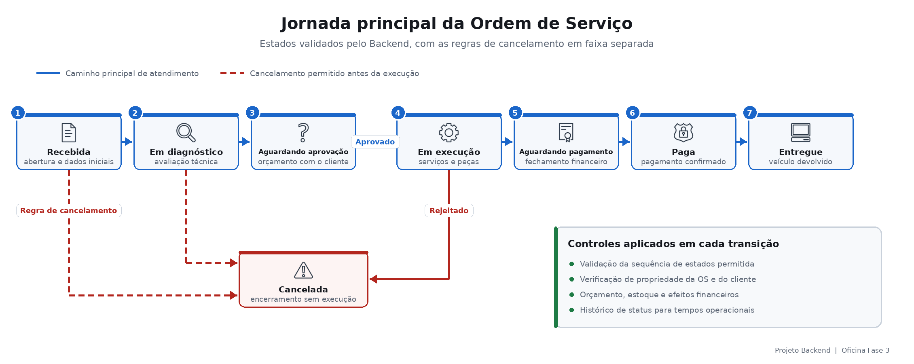

# Visão de negócio e engenharia da solução

## 1. Contexto de negócio

A Oficina é uma plataforma de apoio à operação de uma oficina mecânica. Seu objetivo é organizar informações e regras que normalmente ficam distribuídas entre atendimento, equipe técnica, estoque, fornecedores e financeiro.

O sistema acompanha o veículo desde a recepção até a entrega, mantendo rastreabilidade sobre cliente, diagnóstico, orçamento, peças, serviços, pagamento e evolução da Ordem de Serviço (OS). A Fase 3 preserva esse domínio e responde ao cenário de crescimento da base de clientes e expansão para múltiplas unidades, com maior segurança, disponibilidade e capacidade de acompanhamento.

A evolução atual prioriza requisitos não funcionais e operação em nuvem. O modelo de domínio ainda não cadastra filiais nem implementa segregação multitenant; uma futura gestão explícita por unidade deverá ser tratada como nova evolução funcional.

### Usuários e interesses

| Perfil | Necessidade atendida |
|---|---|
| Cliente | Autenticar-se por CPF, consultar sua OS, avaliar o orçamento e acompanhar o atendimento. |
| Funcionário da oficina | Cadastrar clientes e veículos, abrir OS, administrar o atendimento e registrar pagamento e entrega. |
| Técnico | Diagnosticar o veículo, incluir serviços e peças, enviar orçamento e concluir o reparo. |
| Gestor | Consultar relatórios, tempos de atendimento, volume de OS, falhas e saúde da operação. |
| Operação de tecnologia | Implantar, escalar, proteger e observar a plataforma de forma reproduzível. |

## 2. Capacidades funcionais

| Área de negócio | Funcionalidades principais |
|---|---|
| Atendimento | Cadastro e situação de clientes, vínculo de veículos e abertura da OS. |
| Catálogo e orçamento | Serviços, peças, preços, composição do orçamento e decisão do cliente. |
| Execução da oficina | Diagnóstico, execução, conclusão, pagamento, entrega e cancelamento controlado. |
| Estoque e suprimentos | Saldo de peças, entradas por nota fiscal, consumo e histórico de movimentações. |
| Financeiro | Contas a pagar por compras, contas a receber por OS e correlações financeiras. |
| Gestão | Relatórios por status, prioridade e data, além de tempos médios do processo. |
| Comunicação | Notificações assíncronas e acompanhamento do processamento sem exposição de dados pessoais. |
| Segurança do cliente | Autenticação por CPF, JWT de curta duração e autorização das APIs protegidas. |

## 3. Jornada principal da Ordem de Serviço



Durante a jornada, a aplicação valida transições de status, propriedade da OS, disponibilidade de peças, composição do orçamento e efeitos financeiros. O histórico de status permite calcular tempos operacionais e demonstrar a evolução do atendimento.

## 4. Evolução da Fase 2 para a Fase 3

A Fase 2 consolidou as regras da oficina em uma aplicação Java com Clean Architecture, persistência relacional, testes automatizados, Docker, Kubernetes, HPA, Terraform e CI/CD. A Fase 3 mantém essa base funcional e evolui a forma como a solução é protegida, implantada e operada.

| Necessidade de evolução | Resposta da Fase 3 |
|---|---|
| Aumento da base de clientes | Backend no EKS, múltiplas réplicas e HPA por CPU e memória. |
| Maior continuidade do serviço | Probes, PodDisruptionBudget, distribuição de pods e RDS gerenciado. |
| Acesso seguro do cliente | API Gateway, autenticação serverless por CPF, JWT RSA e Lambda Authorizer. |
| Menor acoplamento operacional | Quatro repositórios e pipelines independentes para aplicação, Auth, banco e Kubernetes. |
| Entrega previsível | Pull Requests, CI, Terraform Plan, homologação, promoção e produção protegida. |
| Visibilidade da operação | Logs JSON, correlação, traces, APM, métricas, dashboards, alertas e monitor sintético no New Relic. |
| Rastreabilidade acadêmica e técnica | Diagramas, RFCs, ADRs, matriz de requisitos e índice central de evidências. |

Essa separação não transforma automaticamente todo o domínio em microserviços. A aplicação principal continua sendo um **monólito modular orientado ao domínio**, enquanto autenticação, infraestrutura de dados e plataforma Kubernetes possuem ciclos independentes.

## 5. Modelo arquitetural por aplicação

### Backend

O Backend utiliza **Clean Architecture em quatro anéis**:

```text
Infrastructure → Adapter → Usecase → Domain
```

- **Domain:** entidades, regras, value objects, enums e exceções em Java puro.
- **Usecase:** serviços de aplicação e contratos de gateways.
- **Adapter:** controllers, DTOs, persistência, segurança, observabilidade e notificações.
- **Infrastructure:** configurações Spring e composição da aplicação.

As dependências apontam para o centro. O domínio não depende de Spring, JPA, Hibernate ou Servlet. Testes ArchUnit verificam automaticamente os limites entre os anéis.

### Auth Serverless

O Auth adota uma separação leve por responsabilidades, adequada a funções serverless:

- **domain:** validação de CPF e regras sem dependência da AWS;
- **application:** contratos necessários ao fluxo de autenticação;
- **handlers:** entrada e saída das Lambdas;
- **infrastructure:** acesso ao cliente e emissão do JWT;
- **notification e observability:** comunicação assíncrona, logs e telemetria.

A organização é inspirada em Clean Architecture, mas não replica os quatro anéis completos do Backend. As Lambdas permanecem pequenas e orientadas a uma responsabilidade operacional.

### Database

O projeto Database segue arquitetura declarativa de **Infrastructure as Code**. Terraform descreve RDS, rede permitida, segurança, backup, logs, telemetria e outputs. O schema funcional permanece versionado pelas migrations Flyway do Backend, evitando duas fontes de verdade para o modelo.

### Kubernetes

O projeto Kubernetes também utiliza Infrastructure as Code e separa rede, cluster, add-ons e observabilidade. Terraform administra a infraestrutura AWS e os recursos New Relic; Helm e manifestos configuram os componentes internos do cluster.

## 6. Práticas de desenvolvimento

| Prática | Aplicação na solução |
|---|---|
| DDD | O domínio da oficina organiza clientes, veículos, catálogos, estoque, financeiro e o agregado Ordem de Serviço. |
| Clean Architecture | Isola regras de negócio de frameworks e detalhes externos no Backend. |
| SOLID | Separação de responsabilidades, contratos de gateways e inversão de dependências reduzem acoplamento. |
| Clean Code | Nomes orientados ao negócio, responsabilidades delimitadas, formatação automática e revisão por Pull Request. |
| Testes automatizados | JUnit, Mockito, RestAssured, Testcontainers, ArchUnit e testes Python dos scripts e coletores. |
| Qualidade e segurança | Spotless, JaCoCo, SBOM CycloneDX, Trivy, Checkov, TFLint, ShellCheck, actionlint e Gitleaks. |
| Infraestrutura reproduzível | Terraform, HCP Terraform, arquivos por ambiente, plans revisáveis e outputs sincronizados. |
| Observabilidade | Logs estruturados, mascaramento de PII, `correlationId`/`traceId`, métricas, traces e alertas. |
| Entrega controlada | Branches protegidas, Pull Requests, homologação, produção e aprovação por GitHub Environment. |

Clean Code e SOLID são princípios aplicados continuamente; não constituem, isoladamente, um tipo de arquitetura. A conformidade estrutural mais objetiva é fornecida pelos testes ArchUnit, linters, testes automatizados e gates dos pipelines.

## 7. Limites dos quatro repositórios

| Projeto | Contribuição para o negócio | Responsabilidade técnica |
|---|---|---|
| Backend | Executa o atendimento e as regras da oficina. | API Spring Boot, domínio, migrations, Docker e deploy no EKS. |
| Auth | Permite acesso seguro do cliente e entrega notificações desacopladas. | API Gateway, Lambdas, CPF, JWT, Authorizer, SNS, SQS/DLQ e SES opcional. |
| Database | Preserva dados operacionais com consistência, privacidade e recuperação. | RDS PostgreSQL privado, segurança, backup, logs, telemetria e outputs. |
| Kubernetes | Mantém a aplicação disponível, escalável e observável. | VPC, EKS, nodes, add-ons, HPA, New Relic, dashboards e alertas. |

A sequência de implantação e promoção dos quatro projetos está documentada em [CI/CD e promoção](02-cicd/cicd-promocao.md).
