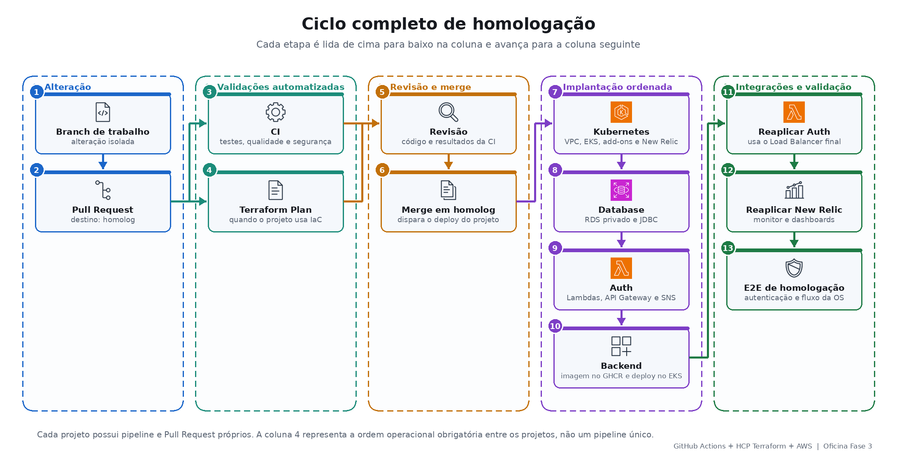
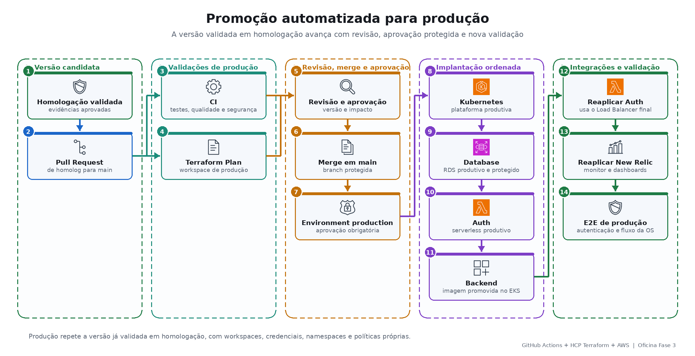

# CI/CD, homologação e produção

## Objetivo

Explicar quando cada pipeline é iniciada, por que ela existe e como uma versão é validada em homologação antes de chegar à produção.

## Regras do ciclo

- `main` é protegida e não recebe commits diretos.
- Mudanças entram por Pull Request.
- CI e Terraform Plan não alteram ambientes.
- Deploys usam GitHub Environments, secrets e workspaces HCP específicos.
- Um projeto só avança quando o anterior termina com sucesso.

## Quem inicia os fluxos

| Evento | Responsável | Resultado |
|---|---|---|
| Push em branch de trabalho | Desenvolvedor | Prepara a mudança para revisão. |
| PR para `homolog` | Desenvolvedor | GitHub Actions executa CI e Plan. |
| Merge em `homolog` | Revisor autorizado | GitHub Actions implanta homologação. |
| PR de `homolog` para `main` | Responsável pela promoção | CI e Plan validam produção. |
| Merge em `main` | Revisor autorizado | Inicia o deploy de produção. |
| Aprovação do Environment | Aprovador de produção | Libera jobs protegidos. |
| `workflow_dispatch` | Operador autorizado | Reexecuta um fluxo de forma controlada. |

## Ciclo completo de homologação

Cada projeto possui PR e workflow próprios. As setas entre Kubernetes, Database, Auth e Backend representam a ordem operacional obrigatória, não um único pipeline entre repositórios.

1. **CI:** valida sintaxe, testes, arquitetura, segurança e artefatos.
2. **Plan:** compara o Terraform com o state e mostra criação, alteração ou destruição.
3. **Kubernetes:** disponibiliza rede, EKS, add-ons e observabilidade inicial.
4. **Database:** cria o RDS e sincroniza o JDBC.
5. **Auth:** publica Lambdas, API Gateway e endpoints.
6. **Backend:** publica a imagem no GHCR e implanta no EKS.
7. **Reaplicações:** atualizam API Gateway e monitor sintético com o Load Balancer final.
8. **E2E:** valida autenticação, autorização e fluxo funcional integrado.

## Promoção para produção

A promoção também ocorre separadamente nos quatro projetos. O responsável acompanha cada PR, merge e deploy antes de iniciar o projeto seguinte.

Produção repete a versão já validada em homologação, mas utiliza workspaces, credenciais, namespaces e políticas próprias. O Environment `production` pode exigir aprovação antes do apply.

## Pipelines por projeto

| Projeto | CI | Plan | Deploy de homologação | Deploy de produção |
|---|---|---|---|---|
| Kubernetes | Terraform, scripts, Helm, New Relic e segurança | Infraestrutura e observabilidade | VPC, EKS, rede, add-ons e New Relic | Mesma plataforma com configuração produtiva |
| Database | Terraform, telemetria e segurança | RDS e componentes auxiliares | RDS privado, logs, telemetria e sincronização do JDBC | RDS produtivo e proteções configuradas |
| Auth | Java, testes, arquitetura, Terraform e segurança | Pacote Lambda e infraestrutura | Lambdas, API Gateway, Authorizer, SNS e DLQ | Componentes serverless produtivos |
| Backend | Formatação, testes, ArchUnit, cobertura, SBOM e segurança | Não utiliza Terraform próprio | Docker, GHCR, EKS, probes, HPA e smoke test | Imagem promovida e deploy no EKS produtivo |

## Por que Auth e observabilidade são reaplicados

O deploy do Backend produz uma nova URL de Load Balancer. A sincronização atualiza variáveis, mas não executa automaticamente outro Terraform apply:

- Auth deve atualizar as integrações HTTP do API Gateway.
- Kubernetes/New Relic deve atualizar o healthcheck e o monitor sintético.

## Critérios de parada

Interrompa o ciclo quando:

- CI ou testes falharem;
- o Plan indicar destruição inesperada;
- credenciais AWS estiverem expiradas;
- o projeto anterior não tiver concluído;
- smoke test, healthcheck ou E2E falhar;
- a evidência do run não estiver disponível.

## Workflows

- [Backend Actions](https://github.com/tiagomiele/fiap-tech-challenge-fase3-oficina-backend/actions)
- [Auth Actions](https://github.com/tiagomiele/fiap-tech-challenge-fase3-oficina-auth-serverless/actions)
- [Database Actions](https://github.com/tiagomiele/fiap-tech-challenge-fase3-oficina-database-infra/actions)
- [Kubernetes Actions](https://github.com/tiagomiele/fiap-tech-challenge-fase3-oficina-kubernetes-infra/actions)
